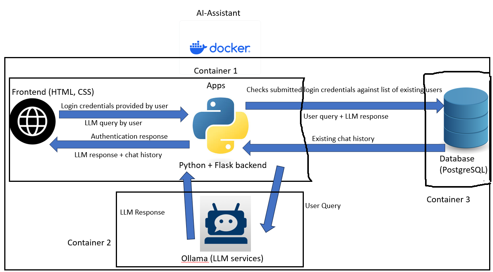

# AI Assistant

A HTML-native implementation of an Ollama-driven AI chatbot intended to empower secured and on-premise local users with access to chatbot services to expedite day-to-day work.

---

## Overview

This application is aimed at the user who operates in a secured, non-internet-facing work environment with limited access to online-hosted LLM APIs/services such as OpenAI's ChatGPT, who are unable to access or use Javascript-based applications. Said users should have highly automatable duties which can be significantly impacted and/or expedited through the use of capabilities of open-source LLMs. This application 


---

## Tech Stack

- **Frontend:** HTML, CSS
- **Backend:** Python with Flask
- **Database:** PostgreSQL
- **Local LLM Integration:** Ollama
- **Containerization:** Docker

---

##  Getting Started

### Prerequisites

- Docker Desktop is installed on your desktop.
- You have a working set of PostgreSQL credentials.
- You should have a code editor such as Visual Studio Code.
- You have an internet connection

### Installation

1. Clone the repository:
   ```bash
   git clone https://github.com/[your-username]/[repo-name].git
   cd [repo-name]

2. Open the docker-compose.yml file in a text editor.
    You should find the following snippet.
        environment:
      - FLASK_ENV=development
      - DB_HOST=db
      - DB_NAME=chatdb
      - DB_USER= (enter your PostgreSQL username here)
      - DB_PASS= (enter your PostgreSQL password here)

3. In the directory [repo-name], build the docker image.
   ```bash
    docker-compose build 

4. Run the application.
   ```bash
    docker-compose up -d  #use the -d flag if you want to run the app detached, otherwise omit this flag

5. Access the application.  
    Open the browser of your choice and navigate to http://localhost:5000.
    You will be prompted to enter your login credentials. For testing purposes, username will be "president" and password will be "obama".
    Once your credentials have been accepted, you will be able to use the application. 

6. Using the application.  
    Simply enter your queries in the input bar at the bottom of the page and hit 'send'. The page will appear to be 'loading', which is how you know your query is being processed by the backend. You can select between the 'Vicuna' and 'LLAMA 3' models in the drop-down selector above the input bar, but note the model choice resets to default after every query due to HTML limitations.

## Architecture Diagram



##  Technology Choices

### Backend

Python with Flask was chosen due to the developer's familiarity with LLM-integrated app design with Flask application backends. Choice was made to split the database-handling functions in a separate .py file to facilitate troubleshooting if necessary and increase modularity of various distinct aspects of the application.

### Database

PostgreSQL was chosen due to ease of use and simplicity of syntax.

### Local LLM Integration

LMStudio was initially evaluated, but Ollama was chosen due to ease of use from within a locally runnable, containerized application service.

##  Local Development Guide

### General guide to making changes

As a rule, as most changes made in the frontend will affect backend files and vice versa, it is recommended to always run docker build again before running docker-compose up to ensure any changes are reflected in the next run of the application.

### Database Configuration

Currently, the init.sql file is set to drop all existing tables due to the nature of this application as a demo, to avoid previously encountered issues where existing tables with mistakenly typecast columns generated persistent errors. However, it is recommended that this function be removed in production. Should you wish to change the "default" user login or add new test users, simply edit init.sql directly.

Refer to docker-compose.yml for required environment variables. Should you desire to use a different user account for PostgreSQL, simply replace the appropriate fields.

### Changing models

If you have identified an LLM/s which you wish to use, and you wish to replace the existing set of models, you will have to edit the frontend chat.html file, replacing the existing model names with the names of the new models you wish to use, making sure that the model name in 'value =' corresponds exactly to the modelname recognized by ollama, as well as changing the models to be pulled in entrypoint.sh. 

### Troubleshooting

While most common errors encountered simply involve checking if the containers required are up and will be specified directly by the application's error handling, one specific error will be covered here. Occasionally, especially if you are a first time user, you might encounter the issue where the frontend notifies you of a type mismatch, noting that user ID is a text value when it should not be, which prevents chat history (and hence the application) from displaying correctly. 
Should this issue be encountered, one can perform the following steps - make sure your postgresql container is running in detached mode first.
    ```bash
    docker ps #to find the container name of your postgresql container
    docker exec -it <container_name> bash #enter the container's terminal
    \d your_table_name #you should be able to see all the columns in your table, and their types, once you run this
    ALTER TABLE your_table_name
    ALTER COLUMN your_user_id_column_name TYPE INTEGER;

Another common issue encountered is when you receive a notification that the model is not working, or you've installed a new model and want to test that everything is working. If so, run this command from within the flaskapp container. 
    ```bash
    curl http://host.docker.internal:11434/api/chat -d '{
        "model": "llama3",
        "messages": [{"role": "user", "content": "Hello"}]
    }'


